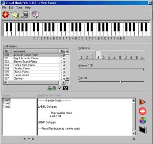



## Visual Music

### Description

This application is the fruit of frustration that I came across with usual mechanical software jobs. I decided to write perfact application but didn't exist the way it was supposed to. And so here's the Visual Music. Includes thousands of lines of cool VB code, graphics, very detailed Microsoft styled on-line help for user and InstallShield wizard script. Here's what it does:

Visual Music lets you play 128 instruments on your PC including Flute, Bagpiper and even whistle! You can even record what you are playing, edit it and save it in a file. If you not expert at playing synthesiser keyboard, it provides you a easy to use scripting language to create music just by telling what key in which instrument you want to play for how much time!
 
### More Info
 

             |
---                |---
**Submitted On**   |2001-11-24 23:19:42
**By**             |[KappaAqr](https://github.com/Planet-Source-Code/PSCIndex/blob/master/ByAuthor/kappaaqr.md)
**Level**          |Advanced
**User Rating**    |4.8 (29 globes from 6 users)
**Compatibility**  |VB 6\.0
**Category**       |[Complete Applications](https://github.com/Planet-Source-Code/PSCIndex/blob/master/ByCategory/complete-applications__1-27.md)
**World**          |[Visual Basic](https://github.com/Planet-Source-Code/PSCIndex/blob/master/ByWorld/visual-basic.md)
**Archive File**   |[Visual\_Mus3727011242001\.zip](https://github.com/Planet-Source-Code/kappaaqr-visual-music__1-29148/archive/master.zip)

